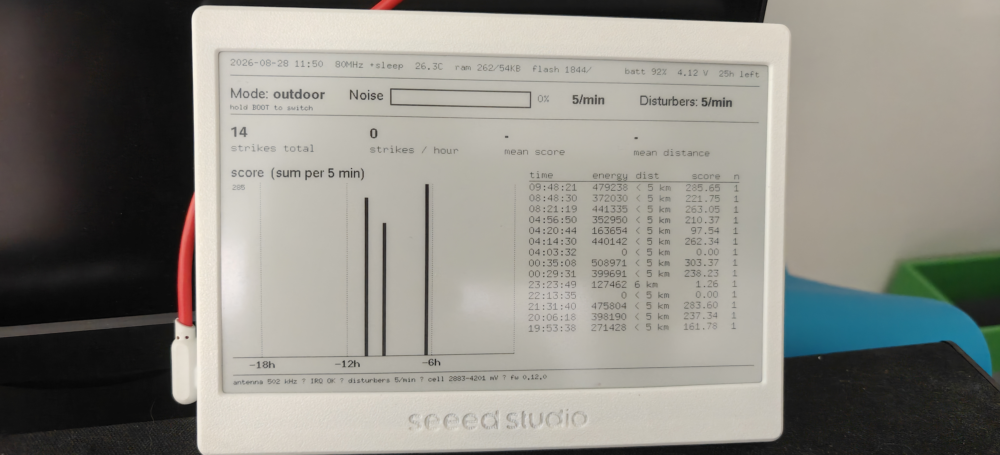
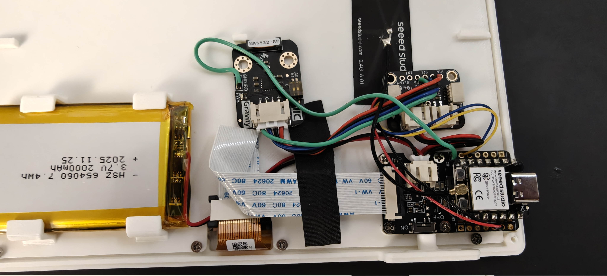
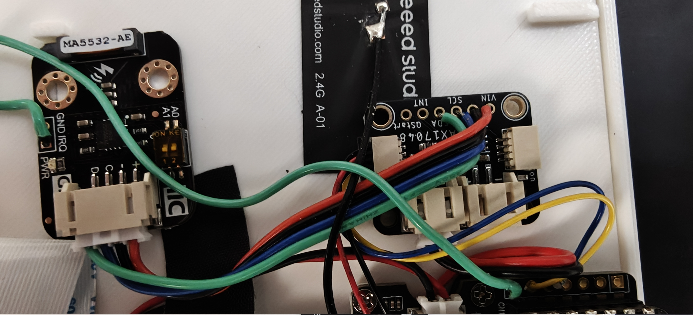

# Rusty Lightning

A 7.5" e-paper terminal that watches for lightning, tunes its own receiver, and
runs up to a week on a battery. Written in Rust for an ESP32-C3, with no RTOS
task soup and no framework — just a wake loop, a sensor on I2C, and a lot of
argument about what silence means.



It listens on **500 kHz** — the frequency lightning actually broadcasts on — and
reports each flash with a distance, an energy and a timestamp. The screen shows
the last day, week or month at a glance, a table of individual strikes, and the
board's own vitals. Hold the button for five seconds and it raises a Wi-Fi
access point with a web UI and a QR code to join it.

## The problem this device is actually about

An AS3935 does not tell you it has gone deaf. It tells you the sky is quiet.

Those are the same reading, and that single fact shapes almost every decision in
this repository. An auto-tune that minimises noise has **deafness as its global
optimum** — a receiver that hears nothing has scored perfectly and will report
success for as long as you leave it. So the interesting engineering here is not
detecting lightning. It is knowing whether you would have.

Some of what that cost, all measured on this device:

| What happened | What it turned out to be |
|---|---|
| **917 strikes in 3.5 hours**, cross-checked against thunder audible outside every 10–30 s | the receiver working, and the distance estimator not: all 917 read the nearest bin |
| **503 "strikes" in 3.5 hours** with no storm within range | an electric hammer on a neighbouring roof, admitted because the tuner had walked spike rejection to zero |
| **99.1%** of the first 2090 records logged as `overhead` | the same thing, for fifteen days, spread evenly across all 24 hours — including 3 a.m., which no thunderstorm is |
| A live storm producing **0 strikes and 875 disturbers** | outdoor gain behind building walls: the returns were arriving and being *misclassified*, not missed |
| `nf 0`, the "most sensitive" setting, giving **300–480 noise/min and zero strikes** | the bottom of the ladder is the *swamped* end, not the sensitive end |
| A device that would silently stop sleeping after **49.7 days** | `saturating_sub` on a wrapping millisecond counter — 13× the current draw, thirty days of battery spent in two and a half |

Every one of those is written down where the decision it forced lives, because a
number in a commit message is a number nobody reads again.




## Getting one running

```sh
./flash.sh                              # build and flash, by MAC not by ttyACM
echo "date $(date +%s)" > /dev/ttyACM0  # set the clock -- flashing stops the RTC
```

Then open the console at 115200 and type `help`. Or hold **BOOT** for five
seconds and point a phone at the screen.

```sh
tools/check.sh          # the host checks, then the release build
tools/release.sh        # stamped images into release/
tools/modules.py        # regenerate the module map
```

---

# The deep half

Everything below is a pointer into a document that goes further. Nothing here is
restated from those documents, because a fact in two places is a fact free to
disagree with itself — which this project has watched happen enough times to
make it a rule.

## The four documents

| Document | What it holds |
|---|---|
| **[Specification](doc/specs.md)** | the whole design, section by section, with `⚠ AS BUILT` callouts wherever reality diverged from the plan — and it diverged often. The hardware, the pinout, the storm logic, the power budget, and §9's honest list of what is still unsettled. |
| **[How this device scans](doc/scanning.md)** | the receiver's argument end to end: what the three interrupt kinds each license, why the tuning space is deliberately *one register*, what "quiet" means and why the verdict is a rate, and §4 on the failure mode the whole design turns on. |
| **[The console](doc/console.md)** | every command, what it does, and what it costs. Also the access point, the golden combination, and how to keep the USB port alive while debugging — light sleep takes it away. |
| **[The modules](doc/modules.md)** | what each of the 34 modules owns, which of them are free of ESP-IDF, what names what, and how a strike travels from the interrupt to the glass. **Generated from the source** by `tools/modules.py`, for the same reason the schematics are. |

## The shape of the code

`src/` is one binary crate — every file is a module, declared in `main.rs`.
There is one device here, so there is no second binary to share code with.

The line that shapes everything is that **`cargo test` cannot run in this
crate**: it only builds for `riscv32imc-esp-espidf`, and every dependency pulls
in ESP-IDF. So the logic worth testing is kept in modules that import nothing
from it, and `tests/` compiles *those very modules* — by `#[path]`, never
copies — with bare `rustc`.

<!-- generated: counts -->
**12 of the 34 modules are ESP-IDF-free, and every one of them is covered.**
<!-- end generated -->

That constraint is why the module list looks the way it does. Whenever a
decision turned out to be worth testing, it was moved out of the module owning
the hardware into one owning only the arithmetic:

| the hardware half | the pure half carved out of it | what paid for the split |
|---|---|---|
| `power` | `policy` | a wrapping subtraction that pinned the device awake for 49.7 days |
| `clock` | `civil` | a wrong date is written into every row of the log, and nothing downstream can detect it |
| `webui` | `query` | the only code here that takes input from outside the device |
| `session` | `merger`, `verdict` | folding return strokes into flashes, and judging a window |
| `as3935` | `strike`, `defence` | the register values, and the ladder over them |

## Two ideas worth stealing

**The golden combination.** The device writes down what it was set to when it
last heard lightning. That is the only unambiguous positive evidence it ever
gets — everything else it measures is quiet, and quiet is two different things
wearing one face. The record is what it boots from, and what it returns to when
it has been deafer than a proven setting for twenty minutes. Silence at a
setting deafer than one this room has *produced strikes at* is evidence about
the receiver, not about the sky.

**The learned floor.** The other end of the same idea: a rung measured to drown
is remembered, and the walk will not relax into it again. Without it, a sweep
would measure `nf 0` at 595 events/min, correctly settle one rung up, and then
relax straight back into it on the next quiet window — where the proportional
climb takes nine notches at once and saturates at fully deaf.

Both live in [`src/golden.rs`](src/golden.rs), free of ESP-IDF and host-tested,
because both are rules rather than plumbing.

## One command table, two front ends

The console parses a line into a `Command`; `commands::run` turns it into an
`Effects` describing what should happen; the loop applies the parts that need
hardware. **The web UI composes a console command line and queues it.** It has
no command table of its own and cannot express anything `help` does not list.

That is not decoration. Written from memory rather than from the command table,
the web UI's allow-list named five words the parser did not know — each composed
a line, parsed to `Unknown`, and the page silently did nothing. The list now
carries each command's arity, and a boot check runs every entry through the real
parser and names any it rejects. It found a sixth on its first run.

## Where the numbers come from

Counts in this repository are **counted, not asserted**. `tools/check.sh` prints
the check total; `doc/modules.md` is regenerated from the source and `check.sh`
refuses to build if it is stale. A number kept by hand in a second file is a
number that goes quietly wrong, which this project has proved about netlists,
about capacity figures, and about a "83 checks" line that named two files out of
eight.

## Status

The sensor has seen real lightning, repeatedly, and the log now records the
spike-rejection setting with every row so a future reader can tell a trustworthy
record from one taken in the configuration that reports hammers.

§9 of the [specification](doc/specs.md) keeps the honest list: what the storms
settled, what they did not, and what is still argued rather than measured. The
biggest open question is stated in [§8 of the scanning
guide](doc/scanning.md) — whether the disturbers *are* the storm — and it needs
one armed `events` window during a real one to answer.


---

Built for a wall in areas where there is another storm along in a few days.
